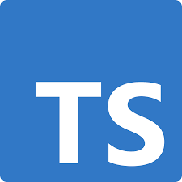

  ### Hi there 👋, I am Aaron Allen

I am a passionate Software Engineer experienced in building full-stack applications with React, Node.js, Docker and other various modern technologies. I am also the Co-creator of Codename Hermes, an open source library aiming to abstract away and standardize the initial setup and implementation of connecting with message brokers. 
<!--
**H3R01A/H3R01A** is a ✨ _special_ ✨ repository because its `README.md` (this file) appears on your GitHub profile.

Here are some ideas to get you started:

- 🔭 I’m currently working on ...
- 🌱 I’m currently learning ...
- 👯 I’m looking to collaborate on ...
- 🤔 I’m looking for help with ...
- 💬 Ask me about ...
- 📫 How to reach me: ...
- 😄 Pronouns: ...
- 💬 Ask me about:
- ⚡ Fun fact: ...

-->

- 🔭 I’m currently working on: Codename Hermes

### Tech I work with:
 

 

